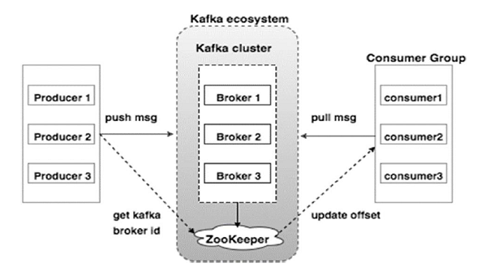
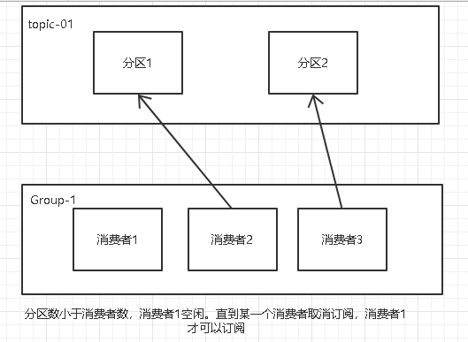

## Kafka 工作流程
### 基本概念 
> Kafka 是一个或多个分区的主题的集合。 Kafka 分区是消息的线性有序序列，其中每个消息由它们的索引 ( 称为偏移 offset ) 来标识。
> Kafka 集群中的所有数据都是不相连的分区联合。 生产者传入消息写在分区的末尾，消息由消费者顺序读取。 通过将消息复制到不同的代理（broker）提供持久性。
> Kafka 以快速，可靠，持久，容错和零停机的方式提供基于pub-sub（“发布/订阅”模式）和队列的消息系统。 在这两种情况下，生产者只需将消息发送到主题，消费者可以根据自己的需要选择任何一种类型的消息传递系统。
### 发布 - 订阅消息的工作流程
- 生产者定期向主题发送消息。
- Kafka 代理（broker）存储该主题配置的分区中的所有消息。它确保消息在分区之间平等共享。如果生产者发送两个消息并且有两个分区，Kafka 将在第一分区中存储一个消息，在第二分区中存储第二消息。
- 消费者订阅该主题。
- 一旦消费者订阅主题，Kafka 将向消费者提供主题的当前偏移，并且还将偏移保存在Zookeeper系统中。
- 消费者将定期请求Kafka（如100 ms）新消息。
- 一旦 Kafka 收到来自生产者的消息，它将这些消息转发给消费者。
- 消费者将收到消息并进行处理。
- 一旦消息被处理，消费者将向 Kafka 代理（broker）发送确认。
- 一旦 Kafka 收到确认，它将更新偏移值，并在 Zookeeper 中更新它。由于偏移（offset）在 Zookeeper 中维护，消费者可以正确地读取下一份数据，即使在服务器崩溃期间。
- 重复以上流程，直到消费者停止请求。
> 消费者可以随时回退/跳到所需的主题偏移量，并阅读所有后续消息。
 

### 队列消息/用户组的工作流
在不是单个消费者的队列消息传递系统中，具有相同GROUP ID 的一组消费者订阅主题时的工作流程。（具有相同 Group ID 的主题的消费者被认为是单个组，并且消息在它们之间共享）
- 生产者以固定间隔向某个主题发送消息。
- Kafka 代理（broker）存储该特定主题配置的分区中的所有消息。
- 当单个消费者订阅特定主题时，假设 Topic-01 的 Group ID 为 Group-1 。
- Kafka 以与发布 - 订阅消息相同的方式与消费者交互，直到新消费者以相同的GROUP ID 订阅相同主题 Topic-01。
- 一旦新消费者到达，Kafka 将其操作切换到共享模式，并在两个消费者之间共享数据。 此共享将继续，直到用户数达到为该特定主题配置的分区数。
- 一旦消费者的数量超过分区的数量，新消费者将不会接收任何进一步的消息，直到现有消费者取消订阅任何一个消费者。 出现这种情况是因为Kafka中的每个消费者将被分配至少一个分区，并且一旦所有分区被分配给现有消费者，新消费者将必须等待。
 
### ZooKeeper的作用
> Zookeeper 是一个分布式配置和同步服务。它是 Kafka 代理和消费者之间的协调接口。 Kafka 服务器通过 Zookeeper 集群共享信息。Kafka在 Zookeeper 中存储基本元数据，例如关于主题，代理，消费者偏移（队列读取器）等的信息。
> 由于所有关键信息存储在 Zookeeper 中，并且它通常在其整体上复制此数据，因此Kafka 代理 / Zookeeper的故障不会影响 Kafka 集群的状态。一旦Zookeeper重新启动。 Kafka 将恢复状态。这为 Kafka 带来了零停机时间。Kafka 代理之间的领导者选举也通过使用 Zookeeper 完成，在领导者失败的情况下由 Zookeeper 重新选举。

